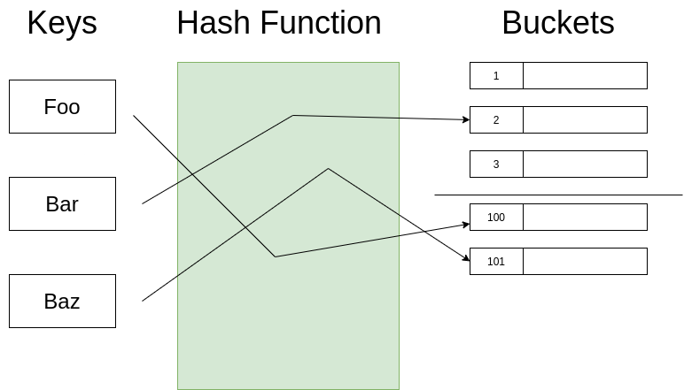
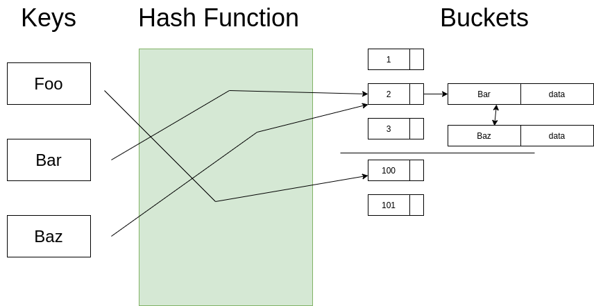
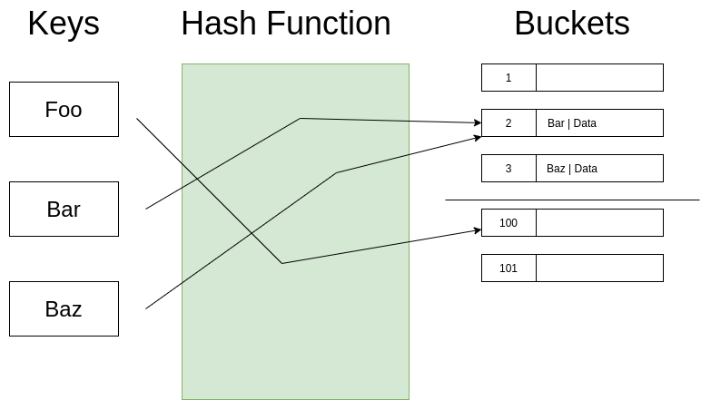
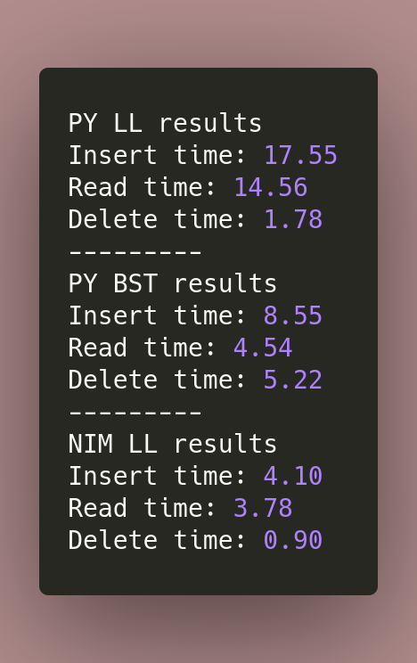
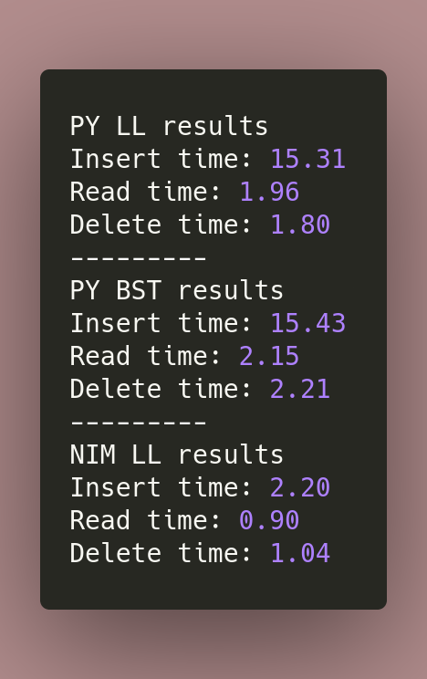
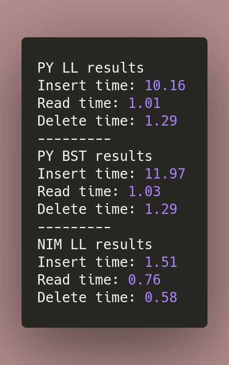
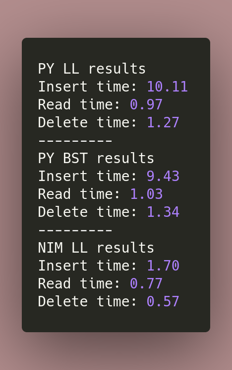

## Hash Table

---



---

## Hash functions

```python

    def hash(key: int, size: int) -> int:
        return key * 2654435761 % size

```

---

## Load factor

```python
    @property
    def load_factor(self):
        return self.load / self.size
```

`self.load` - Number of stored items
`self.size` - Size of the table

---

## Types of hash tables by collision resolution

- Separate chaining
- Open addressing

---

## Separate chaining 

---



---

## Opean addressing

---



---

## Resizing

- All-at-once
- Incremental
- Distribited hash tables hashing
- and etc.

---

## Performance

- Search: 
  - Average O(1)
  - Worst O(n)
- Insert
  - Average O(1)
  - Worst O(n)
- Delete
  - Average O(1)
  - Worst O(n)

---

## Implementation

<https://github.com/roman-right/hash_table/tree/main/implementation>

---

## Results

- Load = 1 000 000
- Max load factor = **100**
- Initial table size = 20000



---

## Results

- Load = 1 000 000
- Max load factor = **10**
- Initial table size = 20000



---

## Results

- Load = 1 000 000
- Max load factor = **1**
- Initial table size = 20000



---

## Results

- Load = 1 000 000
- Max load factor = **0.5**
- Initial table size = 20000



---

## Pros and Cons

Pros 

- Speed

Cons

- Resizing
- Collisions